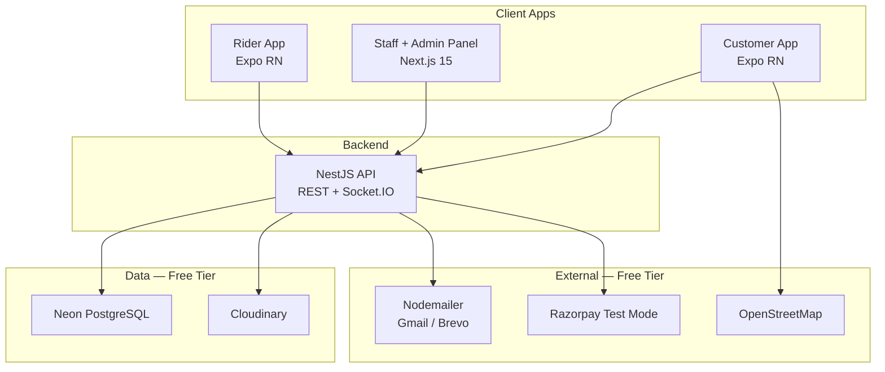
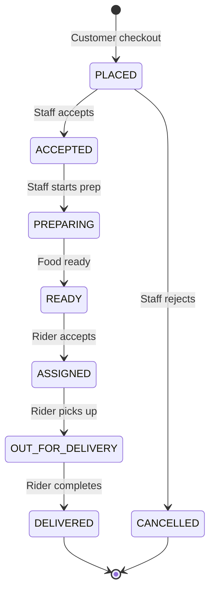
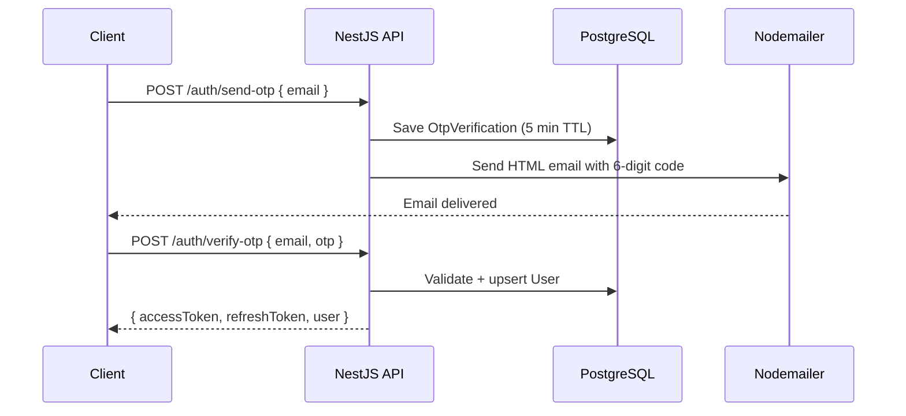

# CaféConnect — Implementation Blueprint (v1 Draft)

> Single-vendor food ordering and delivery platform for one café serving a residential complex and customers within a 7 km radius.
>
> **Version:** v1 draft · **Timeline:** 5 days · **Cost policy:** free-tier services only

---

## Table of Contents

1. [Executive Summary](#1-executive-summary)
2. [Free Services Stack](#2-free-services-stack)
3. [System Architecture](#3-system-architecture)
4. [Monorepo & Folder Structure](#4-monorepo--folder-structure)
5. [Database Schema (Prisma)](#5-database-schema-prisma)
6. [API & Realtime Contract](#6-api--realtime-contract)
7. [Nodemailer OTP Integration](#7-nodemailer-otp-integration)
8. [5-Day Execution Plan](#8-5-day-execution-plan)
9. [Screen-by-Screen Breakdown](#9-screen-by-screen-breakdown)
10. [MVP vs Deferred Matrix](#10-mvp-vs-deferred-matrix)
11. [Post-MVP Roadmap](#11-post-mvp-roadmap)
12. [DevOps & Deployment](#12-devops--deployment)
13. [5-Day Launch Checklist](#13-5-day-launch-checklist)

---

## 1. Executive Summary

### Product

CaféConnect is a dedicated ordering platform for a single café — not a multi-vendor marketplace. It targets residents of a predefined residential society (primary zone) and nearby customers within 7 km (secondary zone).

### Business Problems Solved

| Problem today | v1 solution |
|---------------|-------------|
| WhatsApp / phone orders | Online ordering with structured cart |
| Manual order management | Staff dashboard with status workflow |
| No delivery tracking | Real-time status + rider map pin |
| No customer database | User profiles with order history |
| No analytics | Today's revenue, orders, top items |
| Daily specials chaos | Date-based specials management |

### Tech Stack

| Layer | Technology |
|-------|------------|
| Customer app | React Native (Expo) |
| Rider app | React Native (Expo) |
| Staff + Admin panel | Next.js 15, Tailwind, shadcn/ui |
| API | NestJS, Prisma, Socket.IO |
| Database | PostgreSQL (Neon free tier) |
| Auth OTP | Nodemailer (email OTP) |
| Payments | COD + Razorpay test mode |
| Images | Cloudinary free tier or URL field |
| Maps | OpenStreetMap via react-native-maps |
| Deploy | Neon + Render + Vercel (all free) |

### 5-Day Goal

By end of Day 5, a demo-ready system where:

```
Customer places order → Staff accepts & prepares → Rider delivers → Customer tracks on map
```

All running on **$0 infrastructure** with **email OTP** login for every role.

### Team Assumption

- **Solo dev:** ~10–12 hrs/day, sequential Day 1→5 plan below
- **2–3 devs:** Use parallel workstreams in [Section 8](#8-5-day-execution-plan)

---

## 2. Free Services Stack

Every external dependency in v1 maps to a $0 tier.

| Concern | Service | Free tier limits | Sign up |
|---------|---------|------------------|---------|
| Database | **Neon** | 0.5 GB storage, 1 project | https://neon.tech |
| API hosting | **Render** | 750 hrs/month, spins down after 15 min idle | https://render.com |
| Web hosting | **Vercel** | Hobby tier, unlimited personal projects | https://vercel.com |
| Email OTP | **Nodemailer + Gmail** | Gmail App Password, ~500/day | Google Account settings |
| Email OTP alt | **Brevo (Sendinblue)** | 300 emails/day | https://brevo.com |
| Email dev | **Ethereal Email** | Unlimited test inboxes | Auto-generated in code |
| Image hosting | **Cloudinary** | 25 credits/month | https://cloudinary.com |
| Payments | **Razorpay test mode** | Sandbox only, no real charges | https://razorpay.com |
| Maps | **OpenStreetMap** | Unlimited tiles via react-native-maps | No signup |
| Mobile demo | **Expo Go** | Run on device via QR | https://expo.dev |
| Distance calc | **Haversine (self)** | No API needed | — |

### Explicitly excluded from v1 (paid or unnecessary)

- AWS S3, Redis, MSG91/Twilio SMS, Google Maps API, Firebase FCM, Sentry, GitHub Actions CI, Railway paid tier, EAS paid builds

### Render cold-start warning

Render free tier sleeps after ~15 min idle. First request after sleep takes **30–60 seconds**. For demos, ping the health endpoint 1 min before showing the app:

```
GET https://your-api.onrender.com/health
```

---

## 3. System Architecture

### High-level diagram



### Order lifecycle



### Auth flow (email OTP)



### Application responsibilities

| App | Users | Key screens |
|-----|-------|-------------|
| `customer-mobile` | Residents, nearby customers | Home, menu, cart, checkout, tracking |
| `staff-web` | Café staff | Orders dashboard, menu management |
| `staff-web` `/admin` | Super admin | Users, zone config, today's stats |
| `rider-mobile` | Delivery partners | Available orders, active delivery, earnings |
| `api` | All clients | REST + Socket.IO |

---

## 4. Monorepo & Folder Structure

### Root layout

```
cafeconnect/
├── apps/
│   ├── api/                      # NestJS backend
│   ├── customer-mobile/          # Expo — customer app
│   ├── staff-web/                # Next.js 15 — staff + admin
│   └── rider-mobile/             # Expo — rider app
├── packages/
│   ├── database/                 # Prisma schema, migrations, seed
│   ├── shared/                   # Types, enums, Zod schemas, constants
│   └── ui/                       # Shared shadcn wrappers (web only)
├── turbo.json
├── package.json
├── pnpm-workspace.yaml
└── IMPLEMENTATION.md
```

### `apps/api/` — NestJS

```
apps/api/
├── src/
│   ├── main.ts
│   ├── app.module.ts
│   ├── common/
│   │   ├── guards/               # JwtAuthGuard, RolesGuard
│   │   ├── decorators/           # @Roles(), @CurrentUser()
│   │   └── filters/              # HttpExceptionFilter
│   ├── modules/
│   │   ├── auth/
│   │   │   ├── auth.controller.ts
│   │   │   ├── auth.service.ts
│   │   │   ├── auth.module.ts
│   │   │   ├── mail.service.ts   # Nodemailer wrapper
│   │   │   └── jwt.strategy.ts
│   │   ├── users/
│   │   ├── addresses/
│   │   ├── menu/
│   │   ├── cart/
│   │   ├── orders/
│   │   ├── payments/
│   │   ├── delivery/
│   │   ├── riders/
│   │   ├── analytics/
│   │   ├── admin/
│   │   ├── uploads/
│   │   └── gateway/
│   │       └── orders.gateway.ts # Socket.IO
│   └── utils/
│       └── haversine.ts
├── nest-cli.json
├── package.json
└── tsconfig.json
```

### `apps/staff-web/` — Next.js 15

```
apps/staff-web/
├── src/
│   ├── app/
│   │   ├── (auth)/
│   │   │   └── login/page.tsx
│   │   ├── (staff)/
│   │   │   ├── layout.tsx        # Staff sidebar
│   │   │   ├── dashboard/page.tsx
│   │   │   ├── orders/page.tsx
│   │   │   ├── orders/[id]/page.tsx
│   │   │   └── menu/
│   │   │       ├── page.tsx
│   │   │       ├── new/page.tsx
│   │   │       └── [id]/edit/page.tsx
│   │   └── (admin)/
│   │       ├── layout.tsx        # Admin sidebar
│   │       ├── overview/page.tsx
│   │       ├── users/page.tsx
│   │       └── settings/page.tsx # Zone config
│   ├── components/
│   ├── hooks/
│   │   └── useSocket.ts
│   └── lib/
│       └── api.ts
├── package.json
└── next.config.ts
```

### `apps/customer-mobile/` — Expo

```
apps/customer-mobile/
├── app/
│   ├── (auth)/
│   │   ├── login.tsx
│   │   └── verify-otp.tsx
│   ├── (tabs)/
│   │   ├── index.tsx             # Home
│   │   ├── menu.tsx
│   │   ├── cart.tsx
│   │   └── orders.tsx
│   ├── product/[id].tsx
│   ├── checkout.tsx
│   ├── addresses/
│   │   ├── index.tsx
│   │   └── new.tsx
│   └── order/[id].tsx            # Tracking
├── components/
├── hooks/
│   └── useSocket.ts
├── lib/
│   └── api.ts
└── app.json
```

### `apps/rider-mobile/` — Expo

```
apps/rider-mobile/
├── app/
│   ├── (auth)/
│   │   ├── login.tsx
│   │   └── verify-otp.tsx
│   ├── (tabs)/
│   │   ├── index.tsx             # Available deliveries
│   │   ├── active.tsx            # Current delivery
│   │   └── earnings.tsx
│   └── delivery/[id].tsx
├── hooks/
│   └── useLocation.ts            # Foreground GPS
└── lib/
    └── api.ts
```

### `packages/database/`

```
packages/database/
├── prisma/
│   ├── schema.prisma
│   ├── seed.ts
│   └── migrations/
├── src/
│   └── index.ts                  # export PrismaClient
└── package.json
```

### `packages/shared/`

```
packages/shared/
├── src/
│   ├── enums.ts                  # OrderStatus, UserRole, etc.
│   ├── types.ts                  # Order, MenuItem, User interfaces
│   ├── constants.ts              # ORDER_STATUS_LABELS, etc.
│   └── validators/
│       ├── auth.schema.ts
│       ├── address.schema.ts
│       └── order.schema.ts
└── package.json
```

### Day 1 scaffold commands

```bash
# Initialize monorepo
pnpm init
pnpm add -D turbo typescript

# NestJS API
cd apps && npx @nestjs/cli new api --package-manager pnpm

# Next.js staff panel
npx create-next-app@latest staff-web --typescript --tailwind --app --src-dir

# Expo apps
npx create-expo-app customer-mobile --template tabs
npx create-expo-app rider-mobile --template tabs

# Prisma
cd packages/database && pnpm add prisma @prisma/client -D
npx prisma init
```

---

## 5. Database Schema (Prisma)

### Full schema (`packages/database/prisma/schema.prisma`)

```prisma
generator client {
  provider = "prisma-client-js"
}

datasource db {
  provider = "postgresql"
  url      = env("DATABASE_URL")
}

// ─── Enums ───────────────────────────────────────────────

enum UserRole {
  CUSTOMER
  STAFF
  RIDER
  SUPER_ADMIN
}

enum AddressType {
  SOCIETY
  EXTERNAL
}

enum OrderStatus {
  PLACED
  ACCEPTED
  PREPARING
  READY
  ASSIGNED
  OUT_FOR_DELIVERY
  DELIVERED
  CANCELLED
}

enum RejectReason {
  ITEM_UNAVAILABLE
  KITCHEN_CLOSED
  OUT_OF_STOCK
}

enum PaymentMethod {
  COD
  UPI
  CARD
  NET_BANKING
  WALLET
}

enum PaymentStatus {
  PENDING
  COMPLETED
  FAILED
  REFUNDED
}

enum OptionType {
  SIZE
  ADDON
}

enum DiscountType {
  PERCENTAGE
  FLAT
}

enum ZoneType {
  PRIMARY    // Residential society — lower delivery fee
  SECONDARY  // Within 7 km — standard fee
}

// ─── Auth ────────────────────────────────────────────────

model User {
  id            String    @id @default(cuid())
  email         String    @unique
  phone         String?
  name          String?
  role          UserRole  @default(CUSTOMER)
  isActive      Boolean   @default(true)
  createdAt     DateTime  @default(now())
  updatedAt     DateTime  @updatedAt

  addresses        Address[]
  cart             Cart?
  orders           Order[]         @relation("CustomerOrders")
  riderOrders      Order[]         @relation("RiderOrders")
  riderProfile     RiderProfile?
  notifications    Notification[]

  @@index([email])
  @@index([role])
}

model OtpVerification {
  id        String   @id @default(cuid())
  email     String
  code      String
  expiresAt DateTime
  createdAt DateTime @default(now())

  @@index([email, code])
  @@index([expiresAt])
}

// ─── Café Config (singleton) ─────────────────────────────

model CafeConfig {
  id                  String  @id @default("default")
  name                String
  address             String
  latitude            Float
  longitude           Float
  taxRate             Float   @default(0.05)   // 5% GST
  primaryDeliveryFee  Float   @default(20)       // Society
  secondaryDeliveryFee Float  @default(40)       // 7 km zone
  deliveryRadiusKm    Float   @default(7)
  societyName         String
  isOpen              Boolean @default(true)
  openingTime         String  @default("07:00")
  closingTime         String  @default("22:00")
}

// ─── Society Structure ───────────────────────────────────

model SocietyTower {
  id        String   @id @default(cuid())
  name      String   // e.g. "Tower A"
  wings     String[] // e.g. ["A", "B"]
  maxFloors Int      @default(20)
}

// ─── Addresses ───────────────────────────────────────────

model Address {
  id         String      @id @default(cuid())
  userId     String
  type       AddressType
  label      String      @default("Home") // Home, Work, Other
  isDefault  Boolean     @default(false)

  // Society fields
  societyName String?
  tower       String?
  wing        String?
  floor       String?
  flatNumber  String?

  // External fields
  addressLine String?
  landmark    String?
  pincode     String?
  latitude    Float?
  longitude   Float?

  user   User    @relation(fields: [userId], references: [id], onDelete: Cascade)
  orders Order[]

  @@index([userId])
}

// ─── Menu ────────────────────────────────────────────────

model Category {
  id           String     @id @default(cuid())
  name         String
  description  String?
  imageUrl     String?
  sortOrder    Int        @default(0)
  isActive     Boolean    @default(true)
  items        MenuItem[]
  createdAt    DateTime   @default(now())
}

model MenuItem {
  id           String           @id @default(cuid())
  categoryId   String
  name         String
  description  String?
  imageUrl     String?
  price        Float
  isAvailable  Boolean          @default(true)
  sortOrder    Int              @default(0)
  options      MenuItemOption[]
  category     Category         @relation(fields: [categoryId], references: [id])
  cartItems    CartItem[]
  orderItems   OrderItem[]
  createdAt    DateTime         @default(now())
  updatedAt    DateTime         @updatedAt

  @@index([categoryId])
  @@index([isAvailable])
}

model MenuItemOption {
  id         String     @id @default(cuid())
  menuItemId String
  type       OptionType
  name       String     // "Large", "Extra Cheese"
  priceDelta Float      @default(0)
  isDefault  Boolean    @default(false)
  menuItem   MenuItem   @relation(fields: [menuItemId], references: [id], onDelete: Cascade)

  @@index([menuItemId])
}

model DailySpecial {
  id          String   @id @default(cuid())
  title       String
  description String?
  price       Float
  imageUrl    String?
  availableOn DateTime @db.Date
  isActive    Boolean  @default(true)
  createdAt   DateTime @default(now())

  @@index([availableOn])
}

// ─── Home Screen Content ───────────────────────────────────

model Banner {
  id        String   @id @default(cuid())
  title     String
  subtitle  String?
  imageUrl  String?
  linkType  String?  // "category", "product", "promo"
  linkId    String?
  sortOrder Int      @default(0)
  isActive  Boolean  @default(true)
}

// ─── Cart ────────────────────────────────────────────────

model Cart {
  id        String     @id @default(cuid())
  userId    String     @unique
  couponCode String?
  user      User       @relation(fields: [userId], references: [id], onDelete: Cascade)
  items     CartItem[]
  updatedAt DateTime   @updatedAt
}

model CartItem {
  id         String           @id @default(cuid())
  cartId     String
  menuItemId String
  quantity   Int              @default(1)
  cart       Cart             @relation(fields: [cartId], references: [id], onDelete: Cascade)
  menuItem   MenuItem         @relation(fields: [menuItemId], references: [id])
  options    CartItemOption[]

  @@unique([cartId, menuItemId])
}

model CartItemOption {
  id           String @id @default(cuid())
  cartItemId   String
  optionName   String
  priceDelta   Float
  cartItem     CartItem @relation(fields: [cartItemId], references: [id], onDelete: Cascade)
}

// ─── Coupons ─────────────────────────────────────────────

model Coupon {
  id            String       @id @default(cuid())
  code          String       @unique
  discountType  DiscountType
  discountValue Float
  minOrderValue Float        @default(0)
  maxDiscount   Float?
  expiresAt     DateTime?
  isActive      Boolean      @default(true)
  usageLimit    Int?
  usedCount     Int          @default(0)
}

// ─── Orders ──────────────────────────────────────────────

model Order {
  id              String      @id @default(cuid())
  orderNumber     String      @unique  // CC-20260617-001
  customerId      String
  riderId         String?
  addressId       String
  status          OrderStatus @default(PLACED)
  rejectReason    RejectReason?

  subtotal        Float
  taxAmount       Float
  deliveryFee     Float
  discountAmount  Float       @default(0)
  grandTotal      Float

  couponCode      String?
  zoneType        ZoneType
  paymentMethod   PaymentMethod
  notes           String?

  customer        User        @relation("CustomerOrders", fields: [customerId], references: [id])
  rider           User?       @relation("RiderOrders", fields: [riderId], references: [id])
  address         Address     @relation(fields: [addressId], references: [id])
  items           OrderItem[]
  statusHistory   OrderStatusHistory[]
  payment         Payment?
  riderLocations  RiderLocation[]

  createdAt       DateTime    @default(now())
  updatedAt       DateTime    @updatedAt
  deliveredAt     DateTime?

  @@index([status, createdAt])
  @@index([customerId])
  @@index([riderId])
}

model OrderItem {
  id          String  @id @default(cuid())
  orderId     String
  menuItemId  String
  name        String  // Snapshot at order time
  unitPrice   Float
  quantity    Int
  options     Json    // [{ name, priceDelta }]
  lineTotal   Float
  order       Order   @relation(fields: [orderId], references: [id], onDelete: Cascade)
  menuItem    MenuItem @relation(fields: [menuItemId], references: [id])

  @@index([orderId])
}

model OrderStatusHistory {
  id        String      @id @default(cuid())
  orderId   String
  status    OrderStatus
  note      String?
  createdAt DateTime    @default(now())
  order     Order       @relation(fields: [orderId], references: [id], onDelete: Cascade)

  @@index([orderId])
}

// ─── Payments ────────────────────────────────────────────

model Payment {
  id                String        @id @default(cuid())
  orderId           String        @unique
  method            PaymentMethod
  status            PaymentStatus @default(PENDING)
  amount            Float
  razorpayOrderId   String?
  razorpayPaymentId String?
  razorpaySignature String?
  order             Order         @relation(fields: [orderId], references: [id])
  createdAt         DateTime      @default(now())
  updatedAt         DateTime      @updatedAt
}

// ─── Riders ──────────────────────────────────────────────

model RiderProfile {
  id         String  @id @default(cuid())
  userId     String  @unique
  isOnline   Boolean @default(false)
  user       User    @relation(fields: [userId], references: [id])
}

model RiderLocation {
  id        String   @id @default(cuid())
  riderId   String
  orderId   String?
  latitude  Float
  longitude Float
  speed     Float?
  timestamp DateTime @default(now())
  order     Order?   @relation(fields: [orderId], references: [id])

  @@index([riderId, timestamp])
}

// ─── Notifications (in-app, v1) ──────────────────────────

model Notification {
  id        String   @id @default(cuid())
  userId    String
  title     String
  body      String
  type      String   // ORDER_STATUS, RIDER_ASSIGNED, etc.
  data      Json?
  isRead    Boolean  @default(false)
  user      User     @relation(fields: [userId], references: [id])
  createdAt DateTime @default(now())

  @@index([userId, isRead])
}

// ─── DEFERRED: Phase 2+ models (do not migrate in v1) ───
//
// model LoyaltyTransaction { ... }   // Phase 2
// model Referral { ... }             // Phase 2
// model Subscription { ... }       // Phase 3
// model InventoryItem { ... }        // Phase 3
// model AnalyticsSnapshot { ... }    // v2+
```

### Seed data (`packages/database/prisma/seed.ts`)

Seed the following on Day 1:

```typescript
// Users (OTP: 123456 in dev)
staff@cafe.test      → STAFF
rider@cafe.test      → RIDER
admin@cafe.test      → SUPER_ADMIN
customer@test.com    → CUSTOMER

// CafeConfig
name: "Sunshine Café"
societyName: "Sunshine Residency"
latitude/longitude: café GPS coordinates
deliveryRadiusKm: 7

// SocietyTowers: Tower A, B, C, D (wings, maxFloors)

// Categories: Coffee, Tea, Snacks, Sandwiches, Burgers, Desserts, Beverages

// MenuItems: ~15 sample items with size/add-on options

// DailySpecials: 2 items for today

// Banners: 3 promo banners

// Coupon: FLAT20 — 20% off, min ₹200 (optional v1)
```

---

## 6. API & Realtime Contract

### Base URL

```
Development:  http://localhost:3001/api
Production:   https://cafeconnect-api.onrender.com/api
```

### Auth endpoints

| Method | Path | Auth | Body / Params | Response |
|--------|------|------|---------------|----------|
| POST | `/auth/send-otp` | — | `{ email: string }` | `{ message: "OTP sent" }` |
| POST | `/auth/verify-otp` | — | `{ email, otp, name?, phone? }` | `{ accessToken, refreshToken, user }` |
| POST | `/auth/refresh` | — | `{ refreshToken }` | `{ accessToken }` |
| POST | `/auth/logout` | JWT | — | `{ message: "OK" }` |

### User endpoints

| Method | Path | Auth | Description |
|--------|------|------|-------------|
| GET | `/users/me` | JWT | Get current user profile |
| PATCH | `/users/me` | JWT | Update name, phone |

### Address endpoints

| Method | Path | Auth | Description |
|--------|------|------|-------------|
| GET | `/addresses` | CUSTOMER | List saved addresses |
| POST | `/addresses` | CUSTOMER | Create society or external address |
| PATCH | `/addresses/:id` | CUSTOMER | Update address |
| DELETE | `/addresses/:id` | CUSTOMER | Delete address |
| GET | `/addresses/society-options` | — | List towers/wings/floors |
| POST | `/addresses/validate` | CUSTOMER | Validate zone + return fee estimate |

### Menu endpoints

| Method | Path | Auth | Description |
|--------|------|------|-------------|
| GET | `/menu/categories` | — | List active categories |
| GET | `/menu/items` | — | List available items (filter by category) |
| GET | `/menu/items/:id` | — | Item detail with options |
| GET | `/menu/specials/today` | — | Today's daily specials |
| GET | `/banners` | — | Active home banners |
| POST | `/menu/categories` | STAFF | Create category |
| PATCH | `/menu/categories/:id` | STAFF | Update category |
| POST | `/menu/items` | STAFF | Create menu item |
| PATCH | `/menu/items/:id` | STAFF | Update item / mark unavailable |
| DELETE | `/menu/items/:id` | STAFF | Soft-delete (isAvailable=false) |
| POST | `/menu/specials` | STAFF | Create daily special |
| PATCH | `/menu/specials/:id` | STAFF | Update daily special |

### Cart endpoints

| Method | Path | Auth | Description |
|--------|------|------|-------------|
| GET | `/cart` | CUSTOMER | Get cart with items |
| POST | `/cart/items` | CUSTOMER | Add item `{ menuItemId, quantity, options[] }` |
| PATCH | `/cart/items/:id` | CUSTOMER | Update quantity |
| DELETE | `/cart/items/:id` | CUSTOMER | Remove item |
| DELETE | `/cart` | CUSTOMER | Clear cart |
| POST | `/cart/apply-coupon` | CUSTOMER | Apply coupon code |
| GET | `/cart/preview` | CUSTOMER | Fee breakdown `{ subtotal, tax, deliveryFee, discount, grandTotal }` |

### Order endpoints

| Method | Path | Auth | Description |
|--------|------|------|-------------|
| POST | `/orders` | CUSTOMER | Place order `{ addressId, paymentMethod, notes? }` |
| GET | `/orders` | JWT | List orders (filtered by role) |
| GET | `/orders/:id` | JWT | Order detail + status history |
| PATCH | `/orders/:id/accept` | STAFF | PLACED → ACCEPTED |
| PATCH | `/orders/:id/reject` | STAFF | PLACED → CANCELLED `{ reason }` |
| PATCH | `/orders/:id/status` | STAFF | Update: PREPARING, READY |
| PATCH | `/orders/:id/assign` | RIDER | READY → ASSIGNED |
| PATCH | `/orders/:id/pickup` | RIDER | ASSIGNED → OUT_FOR_DELIVERY |
| PATCH | `/orders/:id/deliver` | RIDER | OUT_FOR_DELIVERY → DELIVERED |

### Payment endpoints

| Method | Path | Auth | Description |
|--------|------|------|-------------|
| POST | `/payments/razorpay/create` | CUSTOMER | Create Razorpay test order |
| POST | `/payments/razorpay/verify` | CUSTOMER | Verify payment signature |
| POST | `/payments/webhook` | — | Razorpay webhook (raw body) |

### Rider endpoints

| Method | Path | Auth | Description |
|--------|------|------|-------------|
| GET | `/riders/available-orders` | RIDER | Orders in READY status |
| GET | `/riders/active-delivery` | RIDER | Current assigned order |
| POST | `/riders/location` | RIDER | `{ latitude, longitude, speed?, orderId? }` |
| GET | `/riders/earnings` | RIDER | `{ today, week, month }` totals |

### Admin endpoints

| Method | Path | Auth | Description |
|--------|------|------|-------------|
| GET | `/admin/stats/today` | SUPER_ADMIN | Orders, revenue, top items |
| GET | `/admin/users` | SUPER_ADMIN | List users by role |
| PATCH | `/admin/users/:id` | SUPER_ADMIN | Activate/deactivate user |
| GET | `/admin/config` | SUPER_ADMIN | Café config |
| PATCH | `/admin/config` | SUPER_ADMIN | Update zone, fees, hours |

### Upload endpoints

| Method | Path | Auth | Description |
|--------|------|------|-------------|
| POST | `/uploads/image` | STAFF | Cloudinary upload → `{ url }` |
| — | — | — | Fallback: pass `imageUrl` string in menu CRUD body |

### Socket.IO events

Connect: `io(API_URL, { auth: { token: accessToken } })`

| Event | Direction | Payload | Description |
|-------|-----------|---------|-------------|
| `order:new` | server → staff | `{ order }` | New order placed |
| `order:status` | server → all | `{ orderId, status, updatedAt }` | Status changed |
| `rider:assigned` | server → customer, rider | `{ orderId, rider }` | Rider assigned |
| `rider:location` | rider → server | `{ latitude, longitude, speed }` | GPS update |
| `rider:location` | server → customer | `{ orderId, latitude, longitude, eta? }` | Broadcast to customer |
| `notification` | server → user | `{ title, body, type, data }` | In-app toast |

**Room naming:**
- `order:{orderId}` — customer + rider + staff subscribed to one order
- `staff` — all staff members
- `rider:{riderId}` — individual rider

### Haversine distance utility

```typescript
// apps/api/src/utils/haversine.ts
export function haversineKm(
  lat1: number, lon1: number,
  lat2: number, lon2: number
): number {
  const R = 6371;
  const dLat = (lat2 - lat1) * Math.PI / 180;
  const dLon = (lon2 - lon1) * Math.PI / 180;
  const a =
    Math.sin(dLat / 2) ** 2 +
    Math.cos(lat1 * Math.PI / 180) *
    Math.cos(lat2 * Math.PI / 180) *
    Math.sin(dLon / 2) ** 2;
  return R * 2 * Math.atan2(Math.sqrt(a), Math.sqrt(1 - a));
}

// Zone logic:
// SOCIETY address → ZoneType.PRIMARY, primaryDeliveryFee
// EXTERNAL address → haversine(cafe, address) ≤ 7km → SECONDARY
// EXTERNAL address → distance > 7km → reject with 400
```

### Order number generation

```typescript
// Format: CC-YYYYMMDD-NNN
const today = format(new Date(), 'yyyyMMdd');
const count = await prisma.order.count({
  where: { createdAt: { gte: startOfDay(new Date()) } }
});
const orderNumber = `CC-${today}-${String(count + 1).padStart(3, '0')}`;
```

---

## 7. Nodemailer OTP Integration

### Install

```bash
cd apps/api
pnpm add nodemailer
pnpm add -D @types/nodemailer
```

### `mail.service.ts`

```typescript
import * as nodemailer from 'nodemailer';
import { Injectable } from '@nestjs/common';

@Injectable()
export class MailService {
  private transporter: nodemailer.Transporter;

  constructor() {
    this.transporter = nodemailer.createTransport({
      host: process.env.SMTP_HOST,
      port: Number(process.env.SMTP_PORT) || 587,
      secure: false,
      auth: {
        user: process.env.SMTP_USER,
        pass: process.env.SMTP_PASS,
      },
    });
  }

  async sendOtp(email: string, code: string): Promise<void> {
    if (process.env.NODE_ENV === 'development') {
      console.log(`[DEV OTP] ${email} → ${code}`);
      // Optionally use Ethereal in dev — see below
    }

    await this.transporter.sendMail({
      from: process.env.SMTP_FROM || 'CaféConnect <noreply@cafeconnect.app>',
      to: email,
      subject: 'Your CaféConnect login code',
      html: `
        <div style="font-family:sans-serif;max-width:400px;margin:0 auto">
          <h2>CaféConnect</h2>
          <p>Your one-time login code is:</p>
          <h1 style="letter-spacing:8px;font-size:36px">${code}</h1>
          <p>Valid for 5 minutes. Do not share this code.</p>
        </div>
      `,
    });
  }
}
```

### Dev: Ethereal Email (zero config)

```typescript
// Use in development only — auto-creates a test inbox
import * as nodemailer from 'nodemailer';

const testAccount = await nodemailer.createTestAccount();
const transporter = nodemailer.createTransport({
  host: 'smtp.ethereal.email',
  port: 587,
  secure: false,
  auth: { user: testAccount.user, pass: testAccount.pass },
});
// Preview URL: nodemailer.getTestMessageUrl(info)
```

### Prod v1: Gmail App Password

1. Enable 2FA on Google Account
2. Go to Google Account → Security → App passwords
3. Generate password for "Mail"
4. Set env vars:

```env
SMTP_HOST=smtp.gmail.com
SMTP_PORT=587
SMTP_USER=your@gmail.com
SMTP_PASS=xxxx xxxx xxxx xxxx
SMTP_FROM=CaféConnect <your@gmail.com>
```

### Prod v1 alt: Brevo (300 free emails/day)

```env
SMTP_HOST=smtp-relay.brevo.com
SMTP_PORT=587
SMTP_USER=your-brevo-login-email
SMTP_PASS=your-brevo-smtp-key
SMTP_FROM=CaféConnect <noreply@yourdomain.com>
```

### `auth.service.ts` — OTP logic

```typescript
async sendOtp(email: string): Promise<void> {
  const code = Math.floor(100000 + Math.random() * 900000).toString();
  const expiresAt = new Date(Date.now() + 5 * 60 * 1000);

  // Invalidate previous OTPs for this email
  await this.prisma.otpVerification.deleteMany({ where: { email } });

  await this.prisma.otpVerification.create({
    data: { email, code, expiresAt },
  });

  await this.mailService.sendOtp(email, code);
}

async verifyOtp(email: string, otp: string, name?: string, phone?: string) {
  // Dev bypass
  if (process.env.NODE_ENV === 'development' && otp === '123456') {
    return this.issueTokens(email, name, phone);
  }

  const record = await this.prisma.otpVerification.findFirst({
    where: { email, code: otp, expiresAt: { gt: new Date() } },
  });

  if (!record) throw new UnauthorizedException('Invalid or expired OTP');

  await this.prisma.otpVerification.deleteMany({ where: { email } });
  return this.issueTokens(email, name, phone);
}
```

---

## 8. 5-Day Execution Plan

### Overview

| Day | Focus | Exit criteria |
|-----|-------|---------------|
| 1 | Foundation + menu | Staff logs in, manages menu via API |
| 2 | Customer ordering | Customer places COD order |
| 3 | Staff operations | Staff manages order lifecycle + realtime |
| 4 | Rider + tracking | Full delivery flow with map |
| 5 | Admin + deploy | Live on free tiers, smoke test passes |

---

### Day 1 — Foundation + Menu

**Hours:** 10–12 · **Priority:** Backend first

#### Hour 0–2: Monorepo + database
- [ ] Init Turborepo with pnpm workspaces
- [ ] Create `packages/database` with Prisma schema (copy from Section 5)
- [ ] Create Neon project → copy `DATABASE_URL`
- [ ] Run `prisma migrate dev --name init`
- [ ] Write and run `seed.ts`

#### Hour 2–4: NestJS API bootstrap
- [ ] Scaffold `apps/api` with NestJS CLI
- [ ] Wire Prisma module (`PrismaService`)
- [ ] Add health endpoint: `GET /health`
- [ ] Configure CORS for localhost + Vercel/Expo origins
- [ ] Add global validation pipe (class-validator)

#### Hour 4–6: Auth module
- [ ] `MailService` with Nodemailer (Ethereal for dev)
- [ ] `AuthService`: send-otp, verify-otp, issue JWT
- [ ] `JwtAuthGuard` + `RolesGuard`
- [ ] Test: send OTP to `staff@cafe.test`, verify with `123456`

#### Hour 6–10: Menu module
- [ ] CRUD: categories, items, options, daily specials
- [ ] `GET /menu/*` public endpoints (no auth)
- [ ] `POST/PATCH/DELETE /menu/*` staff-only
- [ ] Mark item unavailable (`isAvailable: false`)

#### Hour 10–12: Staff web scaffold
- [ ] Init `apps/staff-web` with Next.js 15 + shadcn/ui
- [ ] Login page: email → OTP → verify → store JWT
- [ ] Menu list page + add/edit item form
- [ ] Connect to API with `lib/api.ts` (axios + interceptors)

**Day 1 done when:** Staff logs in → adds menu item → `GET /menu/items` returns it.

---

### Day 2 — Customer Ordering

**Hours:** 10–12 · **Priority:** End-to-end order placement

#### Hour 0–2: Expo customer scaffold
- [ ] Init `apps/customer-mobile` with Expo Router (tabs template)
- [ ] Email OTP login screens (login → verify-otp)
- [ ] Store JWT in `expo-secure-store`
- [ ] API client with auth header

#### Hour 2–6: Home + menu screens
- [ ] Home: banners carousel, categories grid, today's specials
- [ ] Menu list filtered by category
- [ ] Product detail: options selector (size, add-ons), add to cart button

#### Hour 6–8: Cart module (API + UI)
- [ ] `POST /cart/items`, `PATCH`, `DELETE` endpoints
- [ ] Cart screen: item list, qty stepper, remove, subtotal
- [ ] `GET /cart/preview` for fee breakdown

#### Hour 8–10: Address module
- [ ] Society address form: society name (pre-filled), tower picker, wing, floor, flat
- [ ] External address form: address line, landmark, pincode, lat/lng (manual entry or map picker)
- [ ] `POST /addresses/validate` — Haversine check, return zone + delivery fee

#### Hour 10–12: Checkout + order history
- [ ] Checkout screen: address selector, payment method (COD default), order summary
- [ ] `POST /orders` — create order, clear cart
- [ ] Orders tab: list past orders with status badge

**Day 2 done when:** Customer places COD order from society address; `Order` row in DB.

---

### Day 3 — Staff Operations + Realtime

**Hours:** 10–12 · **Priority:** Order lifecycle + live updates

#### Hour 0–4: Orders module (API)
- [ ] `POST /orders` validation: cart not empty, address valid, café open
- [ ] Status machine with allowed transitions enforced server-side
- [ ] `PATCH /orders/:id/accept`, `/reject`, `/status`
- [ ] `OrderStatusHistory` record on every transition
- [ ] Staff order list with status filter

#### Hour 4–6: Staff dashboard UI
- [ ] Tabbed view: New | Preparing | Ready | Completed | Cancelled
- [ ] Order card: customer name, items, total, address, payment method
- [ ] Action buttons: Accept / Reject (with reason modal) / Mark Preparing / Mark Ready
- [ ] Today's revenue + order count in header

#### Hour 6–10: Socket.IO gateway
- [ ] `OrdersGateway` in NestJS with `@WebSocketGateway`
- [ ] On new order: emit `order:new` to `staff` room
- [ ] On status change: emit `order:status` to `order:{id}` room
- [ ] Staff web: `useSocket` hook, toast on new order, auto-refresh list
- [ ] Customer app: subscribe to `order:{id}` on tracking screen

#### Hour 10–12: Customer tracking v1
- [ ] Order detail screen: status stepper (8 steps, highlight current)
- [ ] Show order items, address, total
- [ ] Real-time status update via Socket.IO (no map yet)

**Day 3 done when:** Staff accept → preparing → ready; customer screen updates live.

---

### Day 4 — Rider App + Delivery Tracking

**Hours:** 10–12 · **Priority:** Complete delivery flow

#### Hour 0–4: Rider Expo app
- [ ] Init `apps/rider-mobile` (Expo Router)
- [ ] Email OTP login
- [ ] Available orders tab: orders in READY status
- [ ] Order card: pickup address (café), drop address, distance, payment type
- [ ] Actions: Accept → `ASSIGNED`, Pick Up → `OUT_FOR_DELIVERY`, Complete → `DELIVERED`

#### Hour 4–6: Rider location API
- [ ] `POST /riders/location` — store `RiderLocation`, throttle 1 req/3s
- [ ] Update `RiderProfile.isOnline`
- [ ] Socket.IO: rider emits `rider:location` → server broadcasts to `order:{id}`

#### Hour 6–8: Rider active delivery screen
- [ ] Show current order details
- [ ] `expo-location` foreground GPS — send location every 5s while delivering
- [ ] Pick Up / Complete Delivery buttons

#### Hour 8–10: Customer tracking v2 (map)
- [ ] Install `react-native-maps` (OSM tiles, no API key)
- [ ] Show café pin, delivery address pin, rider pin
- [ ] Subscribe to `rider:location` — animate rider marker
- [ ] Static ETA: `distanceKm / 20 * 60` minutes (assume 20 km/h avg)

#### Hour 10–12: Rider contact + earnings
- [ ] Click-to-call rider: `Linking.openURL('tel:${rider.phone}')`
- [ ] Rider earnings tab: SQL aggregate for today/week/month

**Day 4 done when:** Full `PLACED → DELIVERED` flow works across all apps.

---

### Day 5 — Admin, Payments, Deploy

**Hours:** 10–12 · **Priority:** Live demo on free tiers

#### Hour 0–3: Razorpay test mode
- [ ] Create Razorpay test account → copy test keys
- [ ] `POST /payments/razorpay/create` — create Razorpay order
- [ ] Customer checkout: Razorpay UPI (test card: `success@razorpay`)
- [ ] `POST /payments/razorpay/verify` + webhook handler
- [ ] COD flow unchanged (primary for demo)

#### Hour 3–5: Admin panel
- [ ] `/admin/overview`: today's orders, revenue, top 5 items (bar chart with shadcn)
- [ ] `/admin/users`: table of customers/staff/riders, activate/deactivate toggle
- [ ] `/admin/settings`: edit café name, lat/lng, delivery radius, fees, hours

#### Hour 5–8: Deployment
- [ ] **Neon:** confirm `DATABASE_URL` in production
- [ ] **Render:** deploy `apps/api` as Web Service (Node, `pnpm start:prod`)
- [ ] **Vercel:** deploy `apps/staff-web` (set `NEXT_PUBLIC_API_URL`)
- [ ] Configure Nodemailer SMTP (Gmail or Brevo) in Render env vars
- [ ] Expo: update `EXPO_PUBLIC_API_URL` to Render URL
- [ ] Run DB migrations on production: `prisma migrate deploy`
- [ ] Run seed on production (test accounts only)

#### Hour 8–10: Smoke test
- [ ] Run full [Launch Checklist](#13-5-day-launch-checklist)
- [ ] Fix any blockers

#### Hour 10–12: Polish + buffer
- [ ] Loading states, error toasts, empty states
- [ ] Confirm OTP email arrives in real inbox
- [ ] Document demo credentials for café staff

**Day 5 done when:** Live URLs work; full order flow demoable on mobile + web.

---

### Parallel workstreams (2–3 developers)

| Developer | Day 1 | Day 2 | Day 3 | Day 4 | Day 5 |
|-----------|-------|-------|-------|-------|-------|
| **A — Backend** | API + Prisma + auth + menu | Cart + orders + addresses | Socket.IO + order machine | Rider location API | Razorpay + Render deploy |
| **B — Customer** | — | Expo home + menu + cart + checkout | Tracking v1 stepper | Tracking v2 map | Expo Go smoke test |
| **C — Staff/Rider** | Staff-web + menu UI | — | Order dashboard + realtime | Rider Expo app | Admin + Vercel deploy |

---

## 9. Screen-by-Screen Breakdown

### Customer app (`customer-mobile`)

| Screen | Day | Key elements |
|--------|-----|--------------|
| Login | 2 | Email input, "Send OTP" button |
| Verify OTP | 2 | 6-digit input, verify button, resend after 60s |
| Home | 2 | Banner carousel, categories, today's specials, search bar |
| Menu | 2 | Category filter chips, item cards (image, name, price, badge) |
| Product detail | 2 | Image, description, size/add-on selectors, qty, "Add to cart" |
| Cart | 2 | Item list, qty stepper, subtotal, "Checkout" CTA |
| Addresses | 2 | Saved addresses list, add new (society / external toggle) |
| New address | 2 | Society picker or external form with lat/lng |
| Checkout | 2 | Address, payment (COD/Razorpay), summary, place order |
| Orders list | 2 | Past orders with status badge, tap → detail |
| Order tracking | 3–4 | Status stepper, items, map (Day 4), call rider button |

### Staff web (`staff-web`)

| Screen | Day | Key elements |
|--------|-----|--------------|
| Login | 1 | Email OTP flow |
| Dashboard | 3 | Status tabs, order cards, revenue today, new order toast |
| Order detail | 3 | Full order info, action buttons per status |
| Menu list | 1 | Items table, availability toggle, edit/delete |
| Add/Edit item | 1 | Name, price, category, image URL, options builder |
| Daily specials | 1 | Specials list, add special with date picker |

### Admin web (`staff-web/admin`)

| Screen | Day | Key elements |
|--------|-----|--------------|
| Overview | 5 | Orders today, revenue, top 5 items chart |
| Users | 5 | User table with role filter, active toggle |
| Settings | 5 | Café config form: location, fees, radius, hours |

### Rider app (`rider-mobile`)

| Screen | Day | Key elements |
|--------|-----|--------------|
| Login | 4 | Email OTP flow |
| Available orders | 4 | READY orders list, accept button |
| Active delivery | 4 | Order details, pickup/complete buttons, GPS active indicator |
| Earnings | 4 | Today / week / month totals |

---

## 10. MVP vs Deferred Matrix

### Ships in v1 (5 days, all free)

- [x] Email OTP login (Nodemailer) for all roles
- [x] Society + external addresses with 7 km Haversine validation
- [x] Full menu + daily specials (date-based)
- [x] Cart + checkout with tax and delivery fee
- [x] COD primary + Razorpay test mode UPI
- [x] Full 8-state order workflow
- [x] Staff dashboard with accept/reject/status
- [x] Rider accept / pickup / deliver
- [x] Socket.IO order status + rider location
- [x] Customer tracking (stepper + OSM map pin)
- [x] Click-to-call rider
- [x] Admin: users, zone config, today's stats
- [x] Neon + Render + Vercel deploy
- [x] Cloudinary free or image URL for menu photos

### Deferred backlog

| Feature | v1 status | Target |
|---------|-----------|--------|
| Mobile SMS OTP | Replaced by email OTP | v2 |
| Google login | Deferred | v2 |
| Guest checkout | Deferred | v2 |
| FCM push notifications | Socket.IO toasts only | v2 |
| Predefined rider chat | Deferred | v2 |
| AWS S3 | Cloudinary free / URL | v2 |
| Razorpay live payments | Test mode only | v2 |
| Full coupon engine | Optional FLAT20 hardcoded | v2 |
| Redis Socket.IO | In-process only | v2 |
| Full analytics dashboards | Today only | v2 |
| Google Maps geocoding | Haversine only | v2 |
| Background GPS | Foreground only | v2 |
| Paid hosting (Railway) | Render free | v2+ |
| GitHub Actions CI/CD | Manual deploy | v2 |
| Loyalty points | Deferred | Month 2 |
| Referral program | Deferred | Month 2 |
| Subscription meal plans | Deferred | Month 3 |
| Inventory tracking | Deferred | Month 3 |
| App Store release | Expo Go for v1 | When stable |

---

## 11. Post-MVP Roadmap

| Phase | Timeline | Features |
|-------|----------|----------|
| **v2** | Days 6–10 | SMS OTP (MSG91), Razorpay live, FCM push, Google/guest auth, full coupons |
| **v2+** | Days 11–15 | Full analytics, Redis, CI/CD, Google Maps geocoding, EAS builds |
| **Growth A** | Month 2 | Loyalty (1 pt = ₹1), referral credits (₹50 each) |
| **Growth B** | Month 3 | Subscription meal plans (breakfast/lunch/snacks), inventory tracking |
| **Scale** | Ongoing | App store release, multi-rider optimization, performance tuning |

### Phase 2 schema additions (do not build in v1)

```prisma
// Loyalty
model LoyaltyTransaction {
  id        String   @id @default(cuid())
  userId    String
  orderId   String?
  points    Int      // +earn, -redeem
  createdAt DateTime @default(now())
}

// Referral
model Referral {
  id          String   @id @default(cuid())
  referrerId  String
  refereeId   String?
  refereeEmail String
  status      String   // PENDING, COMPLETED
  creditAmount Float   @default(50)
  createdAt   DateTime @default(now())
}

// Subscription (Phase 3)
model Subscription {
  id        String   @id @default(cuid())
  userId    String
  planType  String   // BREAKFAST, LUNCH, SNACKS
  frequency String   // MONTHLY
  isActive  Boolean  @default(true)
  nextOrderDate DateTime
}
```

---

## 12. DevOps & Deployment

### Environment variables

#### `apps/api` (Render)

```env
NODE_ENV=production
PORT=3001
DATABASE_URL=postgresql://...@ep-xxx.neon.tech/cafeconnect?sslmode=require
JWT_SECRET=<random-64-char-string>
JWT_REFRESH_SECRET=<random-64-char-string>
JWT_EXPIRES_IN=15m
JWT_REFRESH_EXPIRES_IN=7d

# Nodemailer
SMTP_HOST=smtp.gmail.com
SMTP_PORT=587
SMTP_USER=your@gmail.com
SMTP_PASS=your-app-password
SMTP_FROM=CaféConnect <your@gmail.com>

# Razorpay test mode
RAZORPAY_KEY_ID=rzp_test_xxxx
RAZORPAY_KEY_SECRET=xxxx

# Cloudinary (optional)
CLOUDINARY_CLOUD_NAME=xxxx
CLOUDINARY_API_KEY=xxxx
CLOUDINARY_API_SECRET=xxxx

# Café location
CAFE_LAT=19.076090
CAFE_LNG=72.877426

# CORS
CORS_ORIGINS=https://your-staff-web.vercel.app,http://localhost:3000
```

#### `apps/staff-web` (Vercel)

```env
NEXT_PUBLIC_API_URL=https://cafeconnect-api.onrender.com/api
NEXT_PUBLIC_SOCKET_URL=https://cafeconnect-api.onrender.com
```

#### `apps/customer-mobile` + `apps/rider-mobile`

```env
EXPO_PUBLIC_API_URL=https://cafeconnect-api.onrender.com/api
EXPO_PUBLIC_SOCKET_URL=https://cafeconnect-api.onrender.com
```

### Neon setup

1. Create account at https://neon.tech
2. New project → `cafeconnect`
3. Copy connection string from Dashboard → Connection Details
4. Add `?sslmode=require` to connection string
5. Set as `DATABASE_URL` in Render

### Render setup

1. Create account at https://render.com
2. New → Web Service → connect GitHub repo
3. Settings:
   - **Root directory:** `apps/api`
   - **Build command:** `pnpm install && pnpm build`
   - **Start command:** `node dist/main`
   - **Plan:** Free
4. Add all env vars from above
5. Deploy → copy service URL

**Keep-alive trick (optional):** Use a free cron service (e.g. cron-job.org) to ping `/health` every 14 min.

### Vercel setup

1. Import GitHub repo at https://vercel.com
2. Set root directory: `apps/staff-web`
3. Framework: Next.js (auto-detected)
4. Add `NEXT_PUBLIC_API_URL` env var
5. Deploy

### Expo Go demo (no paid EAS)

```bash
cd apps/customer-mobile
# Update EXPO_PUBLIC_API_URL in .env
npx expo start
# Scan QR with Expo Go app on phone
```

### Production migration

```bash
# Run once after first deploy
cd packages/database
DATABASE_URL="your-neon-url" npx prisma migrate deploy
DATABASE_URL="your-neon-url" npx ts-node prisma/seed.ts
```

### Razorpay test mode setup

1. Sign up at https://razorpay.com → switch to **Test Mode**
2. Settings → API Keys → Generate
3. Test UPI ID: `success@razorpay` (always succeeds)
4. Webhook URL: `https://cafeconnect-api.onrender.com/api/payments/webhook`
5. Webhook secret → `RAZORPAY_WEBHOOK_SECRET` env var

---

## 13. 5-Day Launch Checklist

Run this end-to-end before declaring v1 done.

### Auth
- [ ] `staff@cafe.test` receives OTP email (or dev console shows code)
- [ ] Verify with `123456` in dev → JWT returned
- [ ] Invalid OTP returns 401
- [ ] Expired OTP (>5 min) returns 401
- [ ] Staff role can access `/menu` POST; customer cannot

### Menu
- [ ] `GET /menu/items` returns seeded items
- [ ] Staff can add item → appears in customer app
- [ ] Staff marks item unavailable → hidden from customer menu
- [ ] Today's specials shows only items with `availableOn = today`

### Customer ordering
- [ ] Customer logs in via email OTP
- [ ] Can add item with size/add-on to cart
- [ ] Society address saves and appears in checkout
- [ ] External address >7 km from café → validation error shown
- [ ] Checkout shows correct subtotal + tax + delivery fee
- [ ] COD order places successfully → cart cleared
- [ ] Order appears in orders list with status PLACED

### Staff operations
- [ ] New order appears in dashboard (new tab)
- [ ] Socket.IO toast fires on new order (no page refresh)
- [ ] Accept → status ACCEPTED; customer tracking updates
- [ ] Reject with reason → status CANCELLED
- [ ] Preparing → Ready transitions work
- [ ] Revenue today counter increments

### Rider delivery
- [ ] Rider logs in, sees order in READY state
- [ ] Accept → status ASSIGNED; customer sees rider name
- [ ] Pick Up → OUT_FOR_DELIVERY; rider GPS starts sending
- [ ] Complete → DELIVERED; earnings tab updates

### Customer tracking
- [ ] Status stepper shows correct current step
- [ ] Map shows rider pin updating (move rider phone to test)
- [ ] Call rider button opens phone dialer

### Admin
- [ ] `/admin/overview` shows today's order count and revenue
- [ ] Can deactivate a user → they cannot log in
- [ ] Can update delivery fee → new orders use updated fee

### Payments (Day 5)
- [ ] Razorpay test UPI completes → payment status COMPLETED
- [ ] COD order → payment status COMPLETED on delivery

### Deployment
- [ ] `GET https://your-api.onrender.com/health` returns 200
- [ ] Staff web loads at Vercel URL
- [ ] Customer app connects to production API via Expo Go
- [ ] OTP email arrives in real Gmail inbox (not just Ethereal)
- [ ] Production DB has seed data

### Demo script (5 min presentation)

```
1. Open staff-web → login as staff@cafe.test
2. Show menu management (add today's special)
3. Open customer app (Expo Go) → login as customer@test.com
4. Browse menu → add Cappuccino (Large) + Club Sandwich
5. Select society address: Tower B, Floor 9, Flat 903
6. Checkout with COD → order placed
7. Switch to staff-web → new order toast → Accept → Preparing → Ready
8. Open rider app → login as rider@cafe.test → Accept order → Pick Up
9. Switch to customer app → tracking shows rider on map
10. Rider app → Complete Delivery → customer sees DELIVERED
```

---

## Appendix A: Status Transition Rules

```typescript
const ALLOWED_TRANSITIONS: Record<OrderStatus, OrderStatus[]> = {
  PLACED:             ['ACCEPTED', 'CANCELLED'],
  ACCEPTED:           ['PREPARING', 'CANCELLED'],
  PREPARING:          ['READY'],
  READY:              ['ASSIGNED'],
  ASSIGNED:           ['OUT_FOR_DELIVERY'],
  OUT_FOR_DELIVERY:   ['DELIVERED'],
  DELIVERED:          [],
  CANCELLED:          [],
};
```

## Appendix B: Fee Calculation

```typescript
function calculateFees(cart: Cart, address: Address, config: CafeConfig, coupon?: Coupon) {
  const subtotal = cart.items.reduce((sum, item) => sum + item.lineTotal, 0);
  const taxAmount = subtotal * config.taxRate;
  const deliveryFee = address.type === 'SOCIETY'
    ? config.primaryDeliveryFee
    : config.secondaryDeliveryFee;

  let discountAmount = 0;
  if (coupon?.code === 'FLAT20' && subtotal >= 200) {
    discountAmount = subtotal * 0.20;
  }

  const grandTotal = subtotal + taxAmount + deliveryFee - discountAmount;
  return { subtotal, taxAmount, deliveryFee, discountAmount, grandTotal };
}
```

## Appendix C: Key Dependencies

### `apps/api`
```json
{
  "@nestjs/common": "^10",
  "@nestjs/jwt": "^10",
  "@nestjs/passport": "^10",
  "@nestjs/platform-socket.io": "^10",
  "@nestjs/websockets": "^10",
  "passport-jwt": "^4",
  "nodemailer": "^6",
  "socket.io": "^4",
  "razorpay": "^2",
  "cloudinary": "^2",
  "@prisma/client": "workspace:*"
}
```

### `apps/customer-mobile` / `apps/rider-mobile`
```json
{
  "expo-router": "~4",
  "expo-secure-store": "~14",
  "expo-location": "~18",
  "react-native-maps": "1.18",
  "socket.io-client": "^4",
  "axios": "^1"
}
```

### `apps/staff-web`
```json
{
  "next": "^15",
  "tailwindcss": "^3",
  "@radix-ui/react-*": "latest",
  "socket.io-client": "^4",
  "axios": "^1",
  "recharts": "^2"
}
```

---

*CaféConnect v1 Implementation Blueprint — generated for 5-day free-tier MVP build.*
